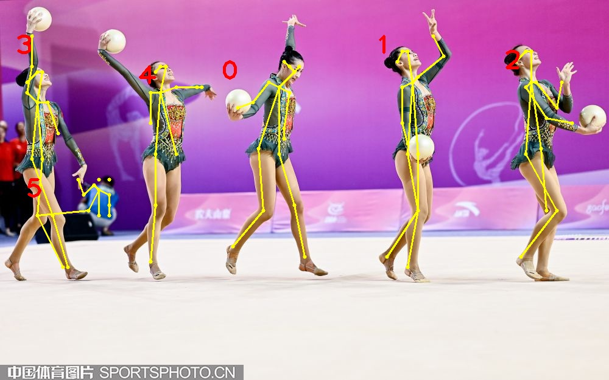
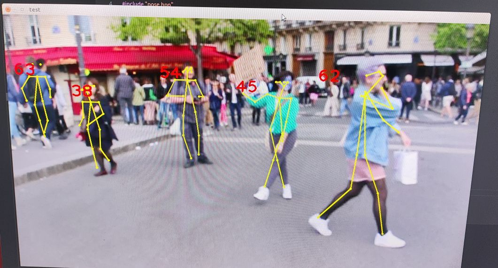
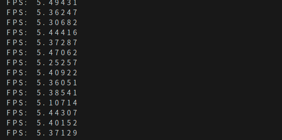

# Human_Pose_Estimation_on_Jetson_Nano

This project is designed for running human_pose_estimation algorithm on embedded devide nvdia jetson nano.  We have made several achivements to enhance the performance.
    --use network models after pruning for lightweight application on jeston nano, according to paper [Real-time 2D Multi-Person Pose Estimation on CPU: Lightweight OpenPose](https://arxiv.org/pdf/1811.12004.pdf);
    --instead of original python code, we rewrite the post processing code with C++ with OpenCV for faster inference speed;
    --based on the GPU on jetson nano, we increase the CUDA acceleration code to further improve the inference progress.

We first run some tests on single pictures, the result shown as follows:

<p align="center">
  
</p>

Then we use a video as our final demo, which is already written in the code.

## Requirements

* Jetson Nano Developer Kit (4GB)
* Ubuntu18.04 LTS
* CUDA 10.2 with cuDNN  8.2.1
* OpenCV 4.9.0(build with CUDA)

## Usage

We use the model from [lightweight-human-pose-estimation.pytorch](https://github.com/Daniil-Osokin/lightweight-human-pose-estimation.pytorch)

* `cd <path_to_project>`
* `mkdir build && cd build`
* `cmake .. && make && ./poseEstimation`

## Demo

We use video.avi as example, the performance shown as follow, average FPS maitains above 5.

<p align="center">
  
</p>

<p align="center">
  
</p>

## Citation:

If this helps your research, please cite the paper:

```
@inproceedings{osokin2018lightweight_openpose,
    author={Osokin, Daniil},
    title={Real-time 2D Multi-Person Pose Estimation on CPU: Lightweight OpenPose},
    booktitle = {arXiv preprint arXiv:1811.12004},
    year = {2018}
}
```